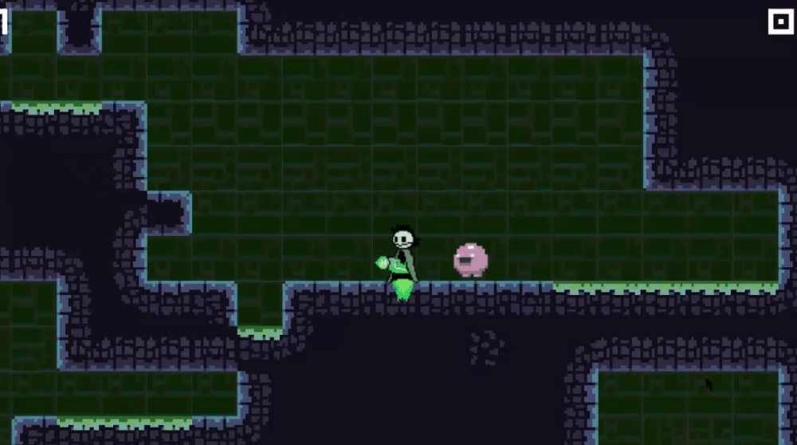

# 2D-Tilemap-Mining

Originally developed for a game jam but I unfortunately couldnt finish in time as I was down with covid half way through the competition :(  
The original plan was to make a rouguelite mining game with player upgrades.

<i>Special thanks to <b>Towneley</b> for the 2D player sprites.</i>

<b>Screenshots:</b>
 
Player Drilling through tiles
 

Jumping, double jumping, and dash
 

Injured
 

Death
 

